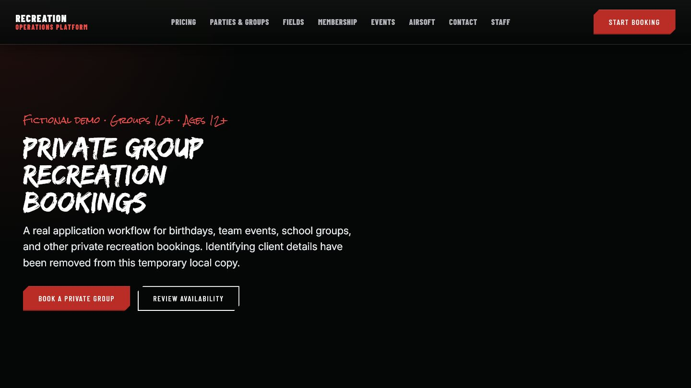
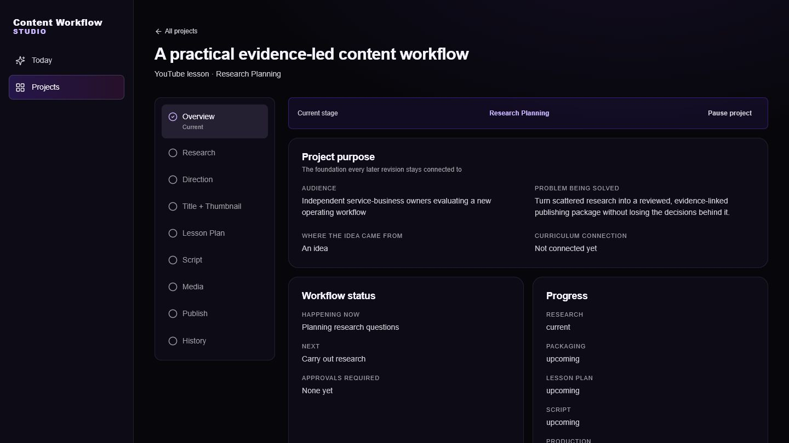

# Savannah O'Byrne

## Product Developer

I build software around real operational problems: understanding the workflow, defining the important rules and data relationships, shaping a usable interface, and verifying that the result behaves as intended. My work spans customer-facing applications, internal operations, relational data, research workflows, and AI-assisted development.

## Featured work

<table>
  <tr>
    <td width="50%" valign="top">
      
      <h3>Client Operations Platform</h3>
      
A full-stack operations application connecting booking journeys, participant requirements, waivers, payment states, check-in, and reporting.

      
<a href="projects/client-operations-platform/README.md">View the case study</a>

    </td>
    <td width="50%" valign="top">
      
      <h3>Content &amp; Brand Systems</h3>
      
A local-first workflow connecting project purpose, research evidence, revision history, human approvals, and export prerequisites.

      
<a href="projects/content-brand-systems/README.md">View the case study</a>

    </td>
  </tr>
</table>

## Additional product work

- [Business Operations, CRM & Lead Generation Systems](projects/business-crm-lead-generation/README.md) — contact and lead records, lifecycle fields, follow-up tasks, filters, dashboards, deduplication, and CSV workflows.
- **Membership & Digital Product Experiences** — account and tier interfaces, application flows, interactive customer tools, and responsive product surfaces.
- [Media Production Workflows](projects/media-production-workflows/README.md) — episode, guest, production, and structured writing workflows.
- [Knowledge & Dataset Tools](projects/knowledge-dataset-tools/README.md) — structured intake, validation, review, search, and export utilities.
- [Customer-Facing Web Applications](projects/customer-facing-web-applications/README.md) — public interfaces, lead capture, booking boundaries, validation, and deployment preparation.

## Technical toolkit

- **Languages and interfaces:** TypeScript, JavaScript, Python, React, Next.js
- **Application and API work:** FastAPI, REST APIs, reusable components, validation, error handling
- **Data:** PostgreSQL, SQLite, Prisma, SQLAlchemy, relational schemas and migrations
- **Quality:** Vitest, Python tests, typechecking, linting, production builds, hands-on workflow verification
- **Delivery foundations:** Git, GitHub, AWS configuration and migration preparation, Vercel-oriented web applications
[See the technical proof summary](proof/technical-proof-summary.md)

## Development approach

I start with the user and operating workflow, then make the business rules and data relationships explicit before treating implementation as complete. AI coding agents help me investigate and implement, but I review the resulting changes and use automated checks, tests, source inspection, and hands-on verification to find problems and confirm important behaviour.

## Private-work explanation

Most of the applications shown here come from private repositories or confidential client work. The linked case studies use sanitized screenshots, public-safe diagrams, verified quality results, and narrow code excerpts so the product and technical work can be evaluated without exposing customer data or confidential implementation details.

[Read the public-safe private-work explanation](proof/private-work-explanation.md)

## Current role direction

I am pursuing product-development work where I can contribute to SaaS applications, operational workflows, troubleshooting, testing, and thoughtful AI-assisted delivery while continuing to deepen my engineering practice within a collaborative team.

## Contact

[savannahoby@gmail.com](mailto:savannahoby@gmail.com)
