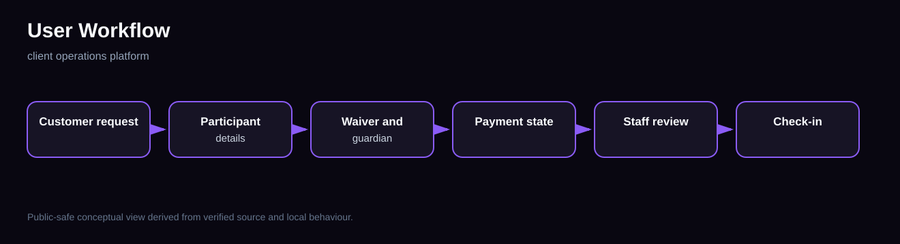
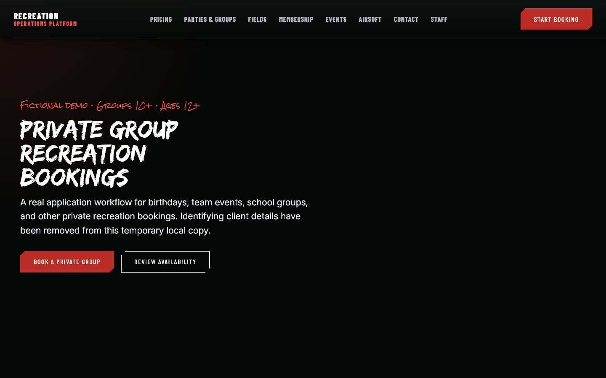
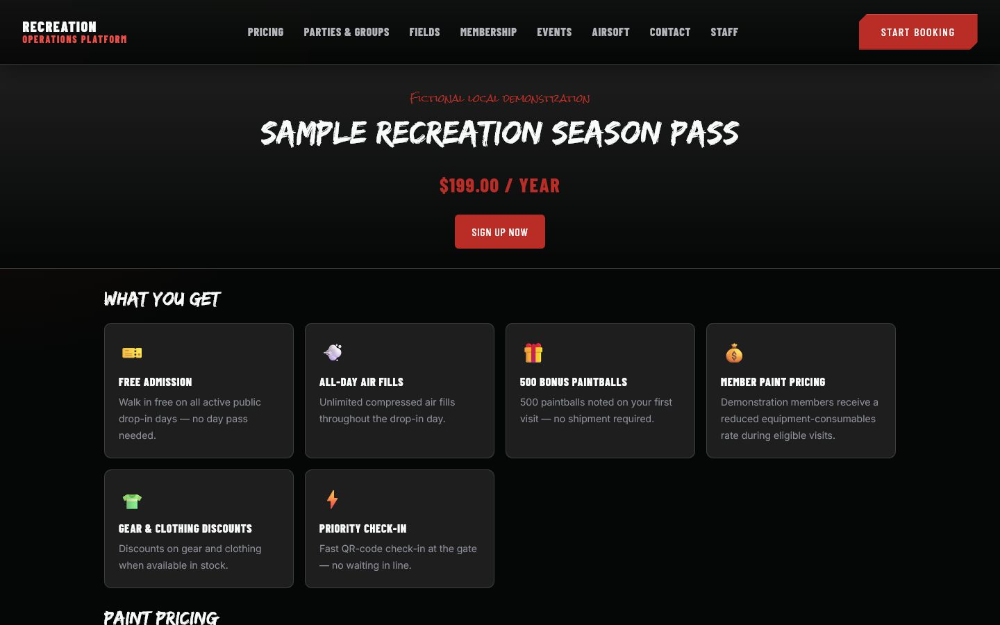
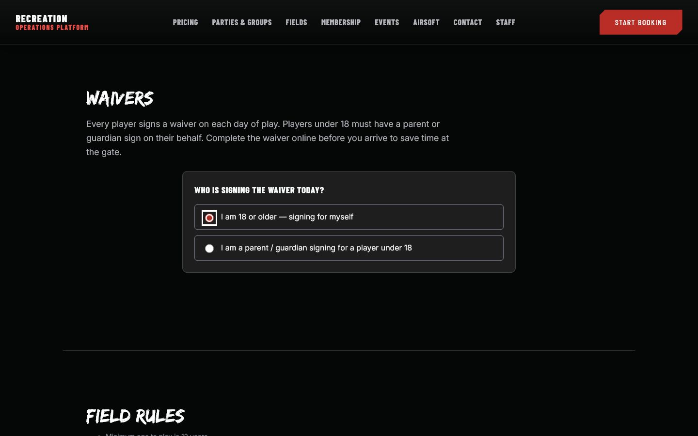
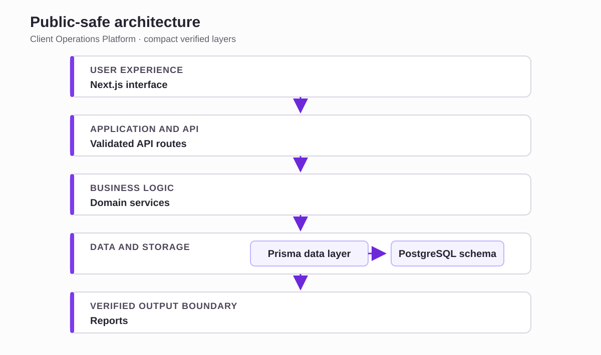
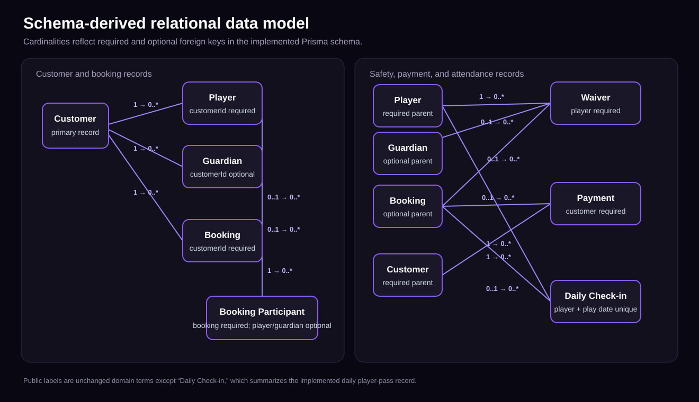

# Client Operations Platform

**A full-stack customer and staff operations application connecting booking-related journeys, participant requirements, waivers, payment states, check-in, and reporting.**

## Product context

This private client application supports a real service business with customer-facing and staff-facing workflows. Screenshots were retaken from a temporary local copy labelled **Recreation Operations Platform**. Identifying client information and client photography were removed, and only fictional demonstration values appear.

## Users and operational problem

Customers need clear paths into bookings, private groups, and memberships. Staff need consistent records and workflow rules across participants, guardians, waivers, payment state, check-in, and reporting.

## What the application does

Source, relational schema, routes, and tests verify booking-related records, participant and guardian relationships, waiver validation, membership surfaces, payment-state handling, staff API boundaries, check-in logic, reporting, and operational validation.

## Main workflows

## Contribution and responsibilities

I led the product and workflow design, defined the important business rules and data relationships, and used AI coding agents to assist with implementation. I reviewed the resulting changes and used automated checks, testing, and hands-on verification to identify problems and confirm important behaviour.

## Screenshots

## Technical architecture

The inspected implementation uses Next.js 16, React 19, TypeScript, Prisma, a PostgreSQL schema, Vitest, and AWS CDK configuration. Deployment preparation is not described as a verified deployment.

## Data and workflow design

The source schema represents customers, players, guardians, bookings, booking participants, waivers, payments, and daily check-in records. The ERD shows only relationships and optionality verified from the implemented Prisma schema.

## Validation, permissions, and safeguards

Selected source proof shows required operational fields, an age gate that routes minors to a guardian workflow, and signature/name consistency. Staff endpoints return unauthorized responses when the staff boundary is not satisfied. No production credentials or data were used here.

## Testing and verification

- 192/192 test files and 1,643/1,643 tests passed.
- Typecheck, lint, and production build passed.
- The public routes shown here rendered locally.
- Database-backed staff, booking, payment, and check-in behaviour was not exercised against an isolated PostgreSQL instance.

## Selected code evidence

[Adult waiver validation boundary](code-samples/waiver-validation.md)

[Relational booking schema excerpt](code-samples/relational-schema.md)

[Object-oriented local-storage adapter](code-samples/local-storage-adapter.md)

## Honest project status

Substantial active application with strong automated and build evidence. The evidence does **not** claim that every database-backed workflow was run end to end, that production infrastructure was inspected, or that deployment readiness was established.

## Private repository and confidentiality

The full repository remains private. This case study includes real interfaces captured from a temporary anonymized local copy, a public-safe architecture view, schema-derived relationships, verified counts, and narrow code excerpts. The underlying client identity and repository are not included.
