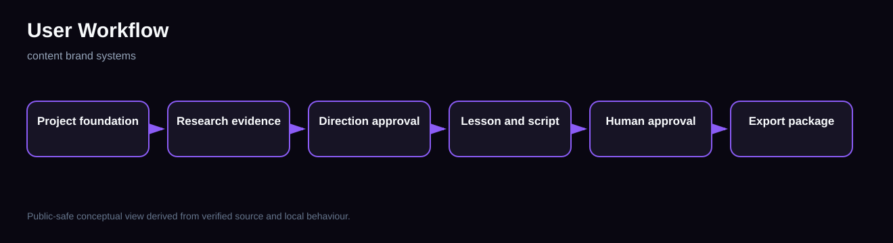
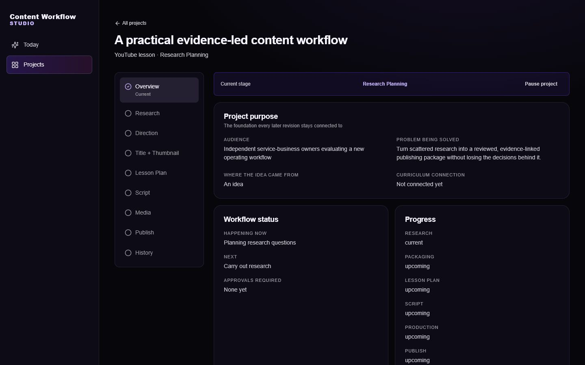
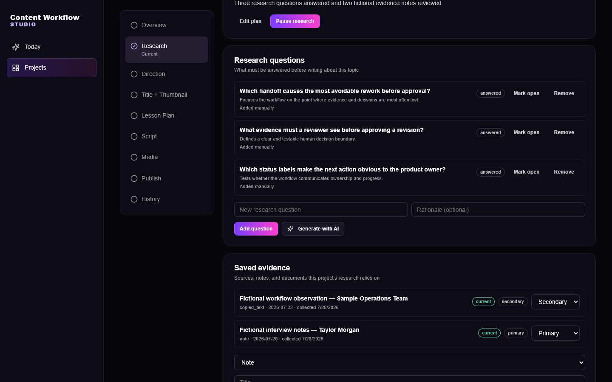
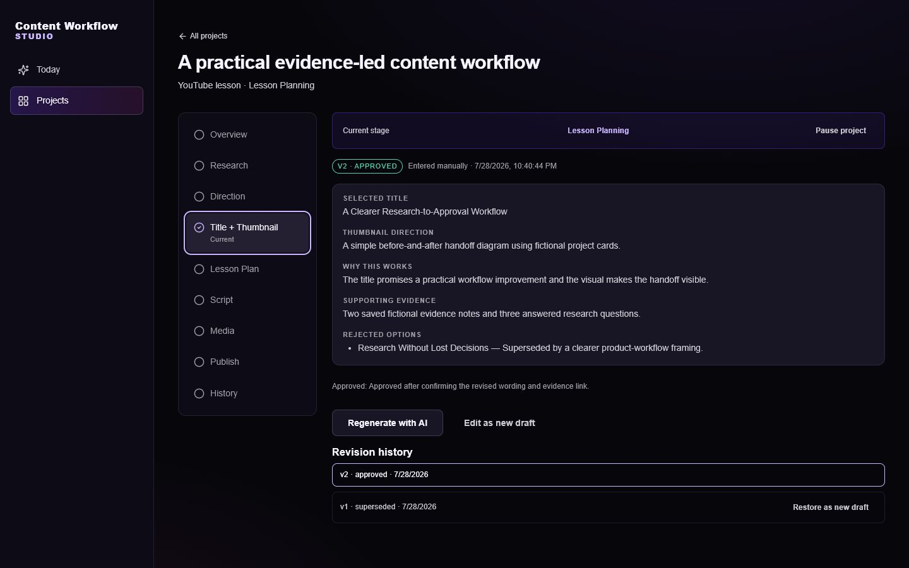
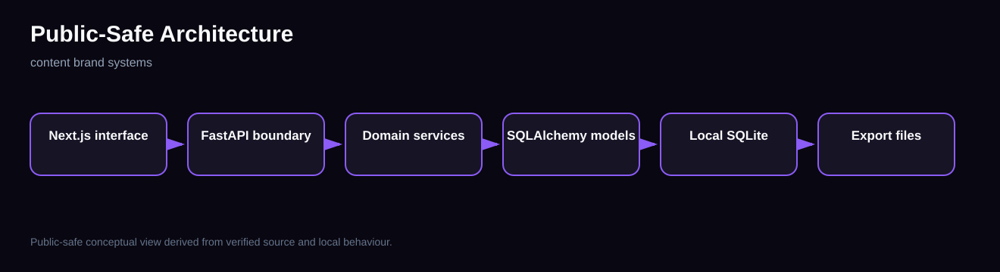
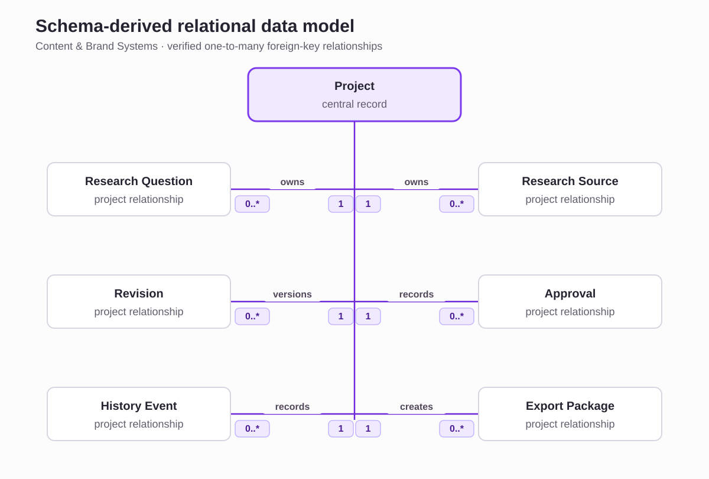

# Content & Brand Systems

**A local-first content production system that keeps project purpose, research evidence, revisions, human approvals, and export prerequisites connected.**

## Product context

The application turns one content idea into a staged, reviewable production package. Screenshots were retaken from a temporary local copy labelled **Content Workflow Studio**. This case study stays at the safe product-interface and generic revision-control level; confidential implementation details and private content are not included.

## Users and operational problem

A content owner needs to preserve why a piece exists, what evidence supports it, which version was approved, and whether later deliverables are ready to export.

## What the application does

The verified local workflow includes project foundations, research planning, saved evidence, revisioned artifacts, approval decisions, status history, and an export gate tied to approved title, lesson plan, and script artifacts.

## Main workflows

## Contribution and responsibilities

I led the product and workflow design, defined the important business rules and data relationships, and used AI coding agents to assist with implementation. I reviewed the resulting changes and used automated checks, testing, and hands-on verification to identify problems and confirm important behaviour.

## Screenshots

## Technical architecture

The verified local stack uses Next.js 15, React 19, TypeScript, FastAPI, SQLAlchemy, SQLite, Vitest, and Python tests.

## Data and workflow design

Projects own research questions, research sources, revisioned artifacts, approval records, history events, and export-package records. The ERD shows only foreign-key relationships verified from the implemented SQLAlchemy models. An approved revision is superseded rather than edited or deleted by the approval service.

## Validation, permissions, and safeguards

The revision service refuses to approve a non-draft revision, refuses known warnings without an explicit override, and records approval/override events. The publishing interface visibly requires approved upstream artifacts.

## Testing and verification

- 117 API, 14 supporting-service, and 10 web tests passed: 141 total.
- Typecheck, lint, and production build passed.
- The UI, API, supporting local service, SQLite database, and fictional demo project ran locally.
- No cloud model output is used as proof.

## Selected code evidence

[Human approval and immutable revision state](code-samples/human-approval.md)

## Honest project status

Functional local application with passing quality gates and demonstrated project, research, and publishing-prerequisite interfaces.

## Private repository and confidentiality

The full repository remains private. All screenshots use a fictional local project and neutral product label. Confidential implementation details and private business material are excluded.
